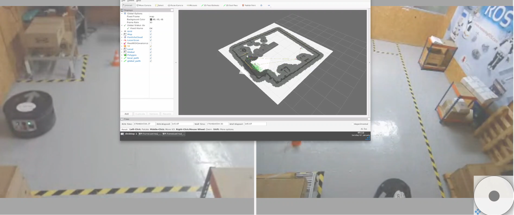

# CheckPoint 6 Autonomous Navigation

<a name="readme-top"></a>

## About The Project
The goal of this project is to design the Navigation System of a mobile robot that must work in a warehouse. In the first part of the project, the navigation system of the RB1 mobile robot was configured, including:
* Created a map of the warehouse
* Localized the RB-1 in the map
* Launch the Nav2 system that allows to send navigation goals to the robot
* Configured all the required navigation parameters for cartographer

</br>
In the second part of the project, the Simple Commander API was used to create some navigation routes for the robot.



<!-- GETTING STARTED -->
## Getting Started

### Software Prerequisites
* Ubuntu 22.04
* ROS1 Noetic
* ROS2 Galactic


<p align="right">(<a href="#readme-top">back to top</a>)</p>

<!-- INSTALLATION -->
### Installation
1. Clone the repo:
   ```sh
   cd ~ && \
   git clone https://github.com/pvela2017/The-Construct-CheckPoint-6-Autonomous-Navigation
   ```
2. Compile the simulation:
   ```sh
   source /opt/ros/noetic/setup.bash && \
   cd ~/The-Construct-CheckPoint-6-Autonomous-Navigation/simulation_ws && \
   catkin_make && \
   cd ~/The-Construct-CheckPoint-6-Autonomous-Navigation/catkin_ws && \
   catkin_make && \
   source /opt/ros/galactic/setup.bash && \
   cd ~/The-Construct-CheckPoint-6-Autonomous-Navigation/ros2_ws && \
   colcon build
   ```
     
<p align="right">(<a href="#readme-top">back to top</a>)</p>


<!-- USAGE -->
## Usage
### Local Simulation & Real Robot
1. Launch the simulation:
   ```sh
   source /opt/ros/noetic/setup.bash && \
   source ~/The-Construct-CheckPoint-6-Autonomous-Navigation/simulation_ws/devel/setup.bash && \
   roslaunch rb1_base_gazebo warehouse_rb1.launch
   ```
2. Launch the ros bridge:
   ```sh
   source /opt/ros/noetic/setup.bash && \
   source ~/The-Construct-CheckPoint-6-Autonomous-Navigation/catkin_ws/devel/setup.bash && \
   roslaunch load_params load_params.launch && \
   source /opt/ros/galactic/setup.bash && \
   ros2 run ros1_bridge parameter_bridge && \
   ```
3. Cartographer:
   ```sh
   source /opt/ros/galactic/setup.bash && \
   source ~/The-Construct-CheckPoint-6-Autonomous-Navigation/ros2_ws/install/setup.bash && \
   ros2 launch cartographer_slam cartographer.launch.py
   ```
4. Mapping:
   ```sh
   source /opt/ros/galactic/setup.bash && \
   source ~/The-Construct-CheckPoint-6-Autonomous-Navigation/ros2_ws/install/setup.bash && \
   ros2 launch map_server map_server.launch.py map_file:=warehouse_map_sim.yaml # simulation
   ros2 launch map_server map_server.launch.py map_file:=warehouse_map_real.yaml # real
   ```
5. Localization:
   ```sh
   source /opt/ros/galactic/setup.bash && \
   source ~/The-Construct-CheckPoint-6-Autonomous-Navigation/ros2_ws/install/setup.bash && \
   ros2 launch localization_server localization.launch.py map_file:=warehouse_map_sim.yaml # simulation
   ros2 launch localization_server localization.launch.py map_file:=warehouse_map_real.yaml # real
   ```
6. Keyboard:
   ```sh
   ros2 run teleop_twist_keyboard teleop_twist_keyboard --ros-args --remap cmd_vel:=/robot/cmd_vel
   ```
7. Path planner:
   ```sh
   source /opt/ros/galactic/setup.bash && \
   source ~/The-Construct-CheckPoint-6-Autonomous-Navigation/ros2_ws/install/setup.bash && \
   ros2 launch path_planner_server pathplanner.launch.py
   ```
8. API commander:
   ```sh
   source /opt/ros/galactic/setup.bash && \
   source ~/The-Construct-CheckPoint-6-Autonomous-Navigation/ros2_ws/install/setup.bash && \
   ros2 launch localization_server localization.launch.py && \
   ros2 launch path_planner_server pathplanner.launch.py && \
   python3 ~/ros2_ws/src/nav2_apps/scripts/move_shelf_to_ship.py
   ```  

<p align="right">(<a href="#readme-top">back to top</a>)</p>

<!-- RESULTS -->
## Results
[](https://www.youtube.com/watch?v=s4jkbh0bWyQ)

<!-- KEYS -->
## Key topics learnt
* Keepout Mask.
